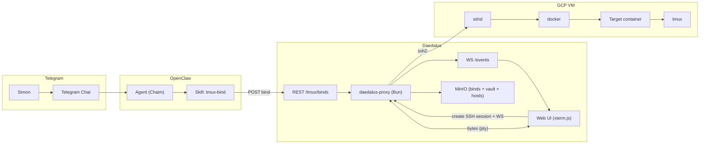
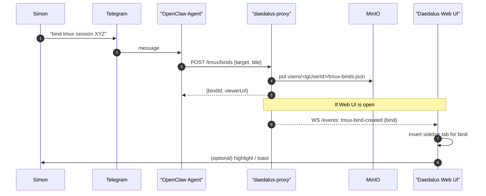
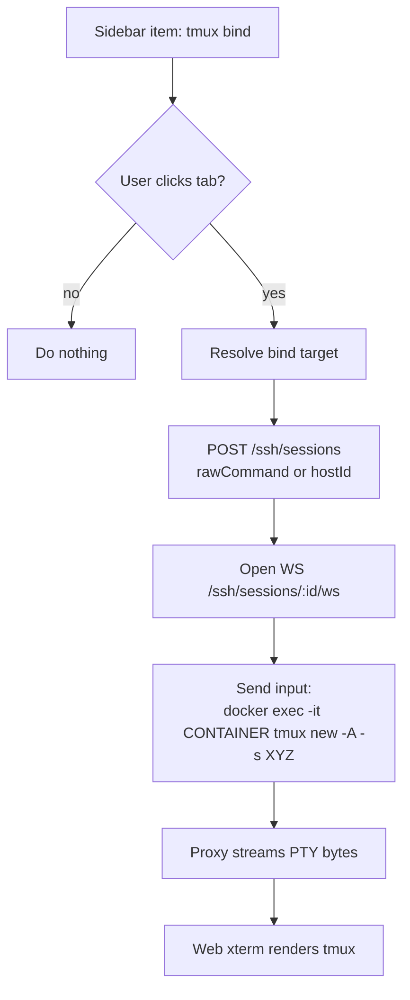
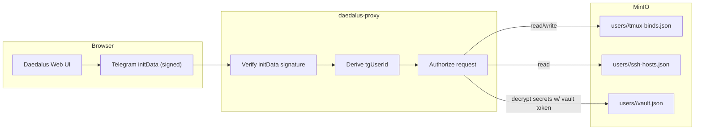

# Daedalus: tmux bind → auto-appears in sidebar (Implementation Plan)

Goal: when an OpenClaw agent uses a `tmux-bind` skill, Daedalus Web UI should **automatically** show a new sidebar item (tab) for that tmux “binding”, scoped to the correct Telegram user profile.

---

## Diagrams (PNG)

- Architecture: 
- Bind create sequence: 
- Click-to-view flow: 
- Auth & scoping: 

---

## Scope choices (recommended defaults)

- **Bind persistence:** persistent until deleted (optional TTL later)
- **Viewer behavior:** “lazy attach” — the bind tab appears instantly; when user clicks it, UI opens an SSH terminal session and runs `tmux new -A -s <name>` (or `docker exec … tmux …`) to render tmux.
- **Security:** verify Telegram identity server-side (phase 2). For quick iteration you can ship phase 1 (path userId) and then harden.

---

## Data model

Store binds per Telegram user.

```ts
// proxy/src/types/tmuxBind.ts (new)
export type TmuxBindTarget =
  | { kind: 'ssh-host'; hostId: string; tmuxSession: string }
  | { kind: 'ssh-host-docker'; hostId: string; containerId: string; tmuxSession: string }
  | { kind: 'ssh-raw'; rawCommand: string; tmuxSession: string };

export type TmuxBind = {
  id: string;               // bind-<uuid>
  title: string;            // sidebar label
  createdAt: string;
  updatedAt: string;
  target: TmuxBindTarget;
  // optional:
  lastOpenedAt?: string;
  autoFocus?: boolean;
};
```

MinIO key:
- `users/<tgUserId>/tmux-binds.json` → `TmuxBind[]`

---

## Backend (daedalus-proxy) changes

### 1) MinIO store helpers
Add:
- `getTmuxBinds(userId): Promise<TmuxBind[]>`
- `putTmuxBinds(userId, binds: TmuxBind[]): Promise<void>`
- `tmuxBindsKey(userId): string`

### 2) REST endpoints
Add routes under existing pattern ` /api/users/:userId/...`:

- `GET  /api/users/:userId/tmux/binds`
  - returns `{ binds: TmuxBind[] }`

- `POST /api/users/:userId/tmux/binds`
  - body: `{ title, target }`
  - returns `{ bind, viewerUrl }`

- `DELETE /api/users/:userId/tmux/binds/:bindId`
  - removes bind

**viewerUrl** can be UI-facing, e.g.
- `https://daedalus.wheelbase.io/#/bind/<bindId>`

### 3) Realtime events so it appears automatically
Add a lightweight user-scoped event websocket:

- `WS /api/users/:userId/events`
  - backend maintains `Map<userId, Set<ws>>`
  - on bind creation: broadcast

Event payload:
```json
{ "type": "tmux-bind-created", "bind": { ... } }
```

Also consider:
- `tmux-bind-deleted`
- `tmux-bind-updated`

### 4) (Optional) Dedicated tmux websocket (not required for v1)
Skip for v1.

v1 can do “lazy attach” by reusing existing SSH terminal websocket and sending `tmux` commands as input when the bind tab is clicked.

---

## Frontend (Daedalus Web UI) changes

### 1) New tab type
Extend `SessionTab` union to include:

```ts
type SessionTab =
  | { id: string; type: 'ssh'; title: string; websocketUrl: string }
  | { id: string; type: 'docker'; title: string; websocketUrl: string }
  | { id: string; type: 'tmux-bind'; title: string; bindId: string };
```

### 2) Add API client methods
In `src/api/client.ts` add:
- `listTmuxBinds()`
- `createTmuxBind(payload)`
- `deleteTmuxBind(bindId)`
- `getEventsWebsocketUrl()`

### 3) Sidebar auto-insert (two-layer: restore + realtime)
On app startup:
1) `GET /tmux/binds` → create `tmux-bind` tabs and merge into sidebar
2) Open `WS /events` → on `tmux-bind-created` event, insert a new sidebar item immediately.

### 4) Click behavior (lazy attach)
When user selects a `tmux-bind` tab:
1) Resolve bind → build SSH create payload:
   - `hostId` if available OR `rawCommand`
2) `POST /ssh/sessions`
3) Open WS `/ssh/sessions/:id/ws`
4) Send input string:
   - host tmux: `tmux new -A -s <session>\r`
   - container tmux: `docker exec -it <containerId> tmux new -A -s <session>\r`

Then either:
- replace the bind tab with the created ssh tab, or
- keep bind tab and internally associate it with the ssh tab id.

Recommended UX:
- keep bind tab as a “shortcut”, but after attach, switch focus to the created SSH tab (or display tmux inside the bind tab by reusing the same terminal component).

---

## Auth / profile binding (Telegram userId)

### Phase 1 (fast): trust `userId` path
Works for you but not secure.

### Phase 2 (correct): verify Telegram identity server-side
- Browser includes Telegram `initData` (signed) in a header, e.g. `x-telegram-init-data`.
- Proxy verifies signature using the bot token and derives `tgUserId`.
- Proxy rejects requests where path `:userId` doesn’t match derived id.
- Eventually: stop taking `:userId` from clients at all and derive internally.

This is what ensures binds always land in the right profile and can’t be spoofed.

---

## OpenClaw Skill (`tmux-bind`) behavior

The skill does not need to run a terminal bridge itself; it only:
1) Calls `POST /api/users/<tgUserId>/tmux/binds` with title + target
2) Optionally posts `viewerUrl` back into Telegram

Because the web UI is subscribed to `/events`, the sidebar item appears automatically.

---

## Milestones / task checklist

### M1 — Backend MVP (no auth hardening)
- [ ] Add `tmux-binds.json` store helpers
- [ ] Add REST endpoints: list/create/delete binds
- [ ] Add `/events` websocket and broadcast bind-created

### M2 — Frontend MVP
- [ ] Add binds list load on startup
- [ ] Add `/events` websocket subscription
- [ ] Add `tmux-bind` tabs in sidebar
- [ ] Implement click → create SSH session → send tmux attach/new command

### M3 — Security hardening
- [ ] Add Telegram initData verification + request scoping
- [ ] Ensure binds cannot be created/read across userIds

### M4 — Quality
- [ ] Bind rename/edit
- [ ] Delete from UI
- [ ] Optional TTL / cleanup
- [ ] Optional “read-only mirror” mode

---

## Mermaid sources

### 01-architecture.mmd


### 02-bind-create-sequence.mmd


### 03-click-to-view-flow.mmd


### 04-auth-scope-flow.mmd

